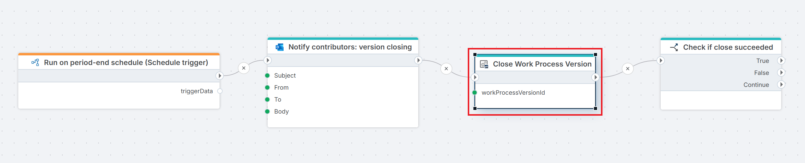

# Close Work Process Version

Closes a Work Process Version by changing its state to **Closed**, thereby preventing further input from contributors.

Use this action at the end of a planning cycle, a deadline enforcement step, or as part of a rollover flow where a new version is opened after the previous one is locked.

 

**Example**   
This Flow runs on a [Schedule trigger](../../../triggers/schedule-trigger.md) at the end of each period to [notify contributors](../../microsoft-365-outlook/send-email-from-shared-mailbox.md) via email that their input window is closing, then closes the Work Process Version to lock it against further input. Finally, a [condition](../../built-in/if.md) evaluates whether the close operation succeeded, branching into true, false, or continue paths accordingly.

## Properties

| Name | Required | Description |
|------|----------|-------------|
| Title | No | A descriptive title for the action, shown in the Flow designer canvas. |
| Connection | Yes | The [InVision Connection](../invision-connection.md) to authenticate against. |
| Work Process Version | Yes | The ID of the Work Process Version to close. You can select from a list or enter a dynamic expression. |
| Include information messages in log | No | When enabled, informational messages from InVision are written to the Flow's execution log. Useful for debugging. |
| Changed by | No | The InVision user ID to record as the actor in the version's audit history. If omitted, the connection's service account is used. |
| Result variable name | No | Name of a Flow variable that will receive `true` if the version was closed successfully, or `false` if the operation failed. |
| Description | No | Free-text notes about this action's purpose or configuration. Not used at runtime. |

## Result Variable

If you specify a **Result variable name**, the variable will be set to:

| Value | Meaning |
|-------|---------|
| `true` | The Work Process Version was successfully closed. |
| `false` | The operation failed — for example, the version was not found, was already closed, or the connection lacked permission. |

Use a [Condition](../../built-in/if.md) action after this step to branch your flow based on the outcome.

## Notes

- **Idempotency**: Closing an already-closed version will typically return `false`. Always check the result variable if your flow may run more than once.
- **Permissions**: The InVision account used by the connection must have sufficient rights to close Work Process Versions. Contact your InVision administrator if the action consistently returns `false`.
- **Changed by field**: Accepts an InVision user ID (numeric). If you need to attribute the closure to the user who triggered the Flow, pass their ID dynamically using a preceding lookup action.

## Related Actions

- [Open Work Process Version](./open-work-process-version.md) — opens a Work Process Version for input.
- [Create Work Process Version](./create-work-process-version.md) — creates a new Work Process Version.
- [Deploy Work Process Version](./deploy-work-process-version.md) — deploys a Work Process Version.
- [Delete Work Process Version](./delete-work-process-version.md) — deletes a Work Process Version.