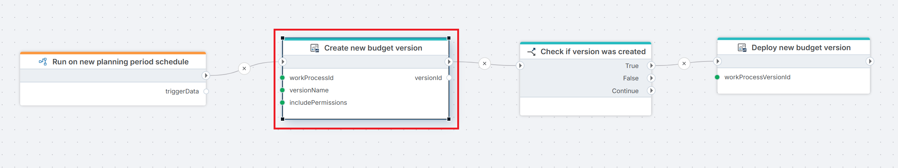

# Create Work Process Version

Creates a new Work Process Version in a draft state, ready for configuration and deployment. Use this action to automate the setup of new planning periods, rolling forecasts, or budget cycles — optionally copying structure and permissions from an existing version.

 

**Example**   
This Flow runs on a [Schedule trigger](../../../triggers/schedule-trigger.md) at the start of a new planning period to create a new Work Process Version in draft state, using the specified work process ID, version name, and permissions. A [condition](../../built-in/if.md) then checks whether the version was successfully created, and if so, passes the version ID to [Deploy Work Process Version](./deploy-work-process-version.md) to make it available for contributor input.

## Properties

| Name | Required | Description |
|------|----------|-------------|
| Title | Optional | A descriptive title for the action, shown in the Flow designer canvas. |
| Connection | Required | The [InVision Connection](../invision-connection.md) to authenticate against. |
| Work Process | Required | The Work Process to create a new version for. Select from the list, choose from a variable, or enter the ID manually. |
| Version name | Required | The name of the new version (e.g. `Budget 2026` or `Forecast Q1`). |
| Version description | Optional | A short description of the version's purpose or scope. |
| Source version | Optional | An existing version to copy structure from. Select from the list, choose from a variable, or enter the ID manually. |
| Copy permissions | Optional | Whether to copy user permissions from the source version. Accepted values: `true` or `false`. |
| Version properties | Optional | Version-specific parameters defined by the Work Process configuration. Fill in values using the pop-up dialog. |
| Created by | Optional | The InVision user ID to record as the creator in the audit history. If omitted, the connection's service account is used. |
| Result variable name | Required | Name of the variable that will receive the ID of the newly created version. Use this ID in subsequent actions such as [Deploy Work Process Version](./deploy-work-process-version.md). |
| Description | Optional | Free-text notes about this action's purpose or configuration. Not used at runtime. |

*Version Properties are defined by the Work Process configuration. Parameter names and available values vary per implementation.*  
.png)  

## Result Variable

The result variable receives the **ID of the newly created version** as a string. Pass this ID to subsequent actions such as [Open Work Process Version](./open-work-process-version.md) or [Deploy Work Process Version](./deploy-work-process-version.md) to continue the automation without hardcoding version IDs.

If creation fails, the variable will be empty or null — use a [Condition](../../built-in/if.md) action to check before proceeding.

## Notes

- **Draft state**: Newly created versions are always in draft. You must [deploy](./deploy-work-process-version.md) and [open](./open-work-process-version.md) the version before contributors can submit data.
- **Source version**: If no source version is provided, a blank version is created based on the Work Process definition alone.
- **Version properties**: These are Work Process-specific parameters set via a pop-up dialog (see screenshot above). 
  Parameter names follow dot-notation (e.g. `Planning.Horizon`, `Planning.DataStartDate`) and support 
  text, numeric, boolean, and date values. Contact your InVision administrator if you are unsure what 
  values are required.

## Related Actions

- [Deploy Work Process Version](./deploy-work-process-version.md) — deploys the newly created version for use.
- [Open Work Process Version](./open-work-process-version.md) — opens the version for contributor input.
- [Close Work Process Version](./close-work-process-version.md) — closes a version at the end of an input period.
- [Delete Work Process Version](./delete-work-process-version.md) — deletes a version that is no longer needed.