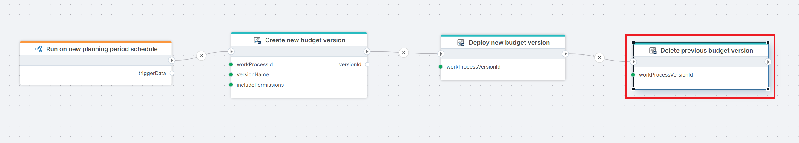

# Delete Work Process Version

Deletes a Work Process Version. Use this action to clean up versions that are no longer needed, such as outdated budget cycles or test versions created during development.

**Example**   
This Flow runs on a [Schedule trigger](../../../triggers/schedule-trigger.md) at the start of a new planning period to [create](./create-work-process-version.md) and [deploy a new budget version](./deploy-work-process-version.md), then immediately deletes the previous budget version to keep the Work Process clean and free of outdated versions.

## Properties

| Name | Required | Description |
|------|----------|-------------|
| Title | No | A descriptive title for the action, shown in the Flow designer canvas. |
| Connection | Yes | The [InVision Connection](../invision-connection.md) to authenticate against. |
| Work Process Version | Yes | The version to delete. Select from the list, choose from a Flow Variable, or choose from a Workspace Variable. |
| Include information messages in log | No | When enabled, informational messages from InVision are written to the Flow's execution log. Useful for debugging. |
| Force delete | No | Forces deletion of versions that cannot be removed through a normal delete — for example, versions left in a partially deleted state. Use this as a fallback when a standard delete returns `false`. |
| Changed by | No | The InVision user ID to record as the actor in the audit history. If omitted, the connection's service account is used. |
| Result variable name | No | Name of a Flow variable that will receive `true` if the version was deleted successfully, or `false` if the operation failed. |
| Description | No | Free-text notes about this action's purpose or configuration. Not used at runtime. |

## Result Variable

If you specify a **Result variable name**, the variable will be set to:

| Value | Meaning |
|-------|---------|
| `true` | The Work Process Version was successfully deleted. |
| `false` | The operation failed — for example, the version was not found or the connection lacked permission. |

Use a [Condition](../../built-in/if.md) action after this step to branch your flow based on the outcome.

## Notes

- **This operation is irreversible**: Deleting a version permanently removes it from the Work Process. Make sure the correct version ID is passed before executing.
- **Force delete**: Use this only when a normal delete fails. It is intended as a recovery mechanism for versions stuck in a partially deleted state, and should not be the default approach.
- **Permissions**: The InVision account used by the connection must have sufficient rights to delete Work Process Versions.

## Related Actions

- [Create Work Process Version](./create-work-process-version.md) — creates a new version in draft state.
- [Deploy Work Process Version](./deploy-work-process-version.md) — deploys a version for use.
- [Open Work Process Version](./open-work-process-version.md) — opens a version for contributor input.
- [Close Work Process Version](./close-work-process-version.md) — closes a version at the end of an input period.