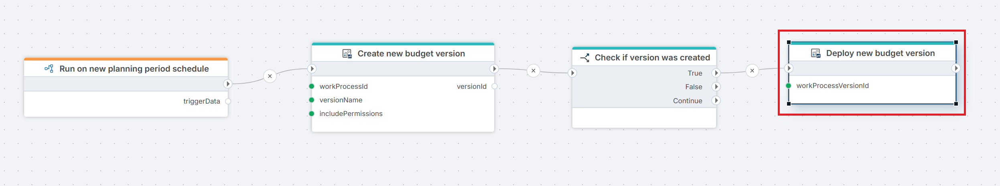

# Deploy Work Process Version

Deploys a Work Process Version, making it available to be opened for contributor input. Once deployed, the version's state is marked as **Deployed**.

Use this action after [Create Work Process Version](./create-work-process-version.md) as part of an automated planning cycle setup, or as a standalone step when redeploying an existing version after configuration changes.

**Example**   
This Flow runs on a [Schedule trigger](../../../triggers/schedule-trigger.md) at the start of a new planning period to [create a new Work Process Version](./create-work-process-version.md) in draft state, using the specified work process ID, version name, and permissions. A [condition](../../built-in/if.md) then checks whether the version was successfully created, and if so, passes the version ID to Deploy Work Process Version to make it available for contributor input.

## Properties

| Name | Required | Description |
|------|----------|-------------|
| Title | No | A descriptive title for the action, shown in the Flow designer canvas. |
| Connection | Yes | The [InVision Connection](../invision-connection.md) to authenticate against. |
| Work Process Version | Yes | The version to deploy. Select from the list, choose from a variable, or enter the ID manually. |
| Include information messages in log | No | When enabled, informational messages from InVision are written to the Flow's execution log. Useful for debugging. |
| Changed by | No | The InVision user ID to record as the actor in the version's audit history. If omitted, the connection's service account is used. |
| Result variable name | No | Name of a Flow variable that will receive `true` if the version was deployed successfully, or `false` if the operation failed. |
| Description | No | Free-text notes about this action's purpose or configuration. Not used at runtime. |

## Result Variable

If you specify a **Result variable name**, the variable will be set to:

| Value | Meaning |
|-------|---------|
| `true` | The Work Process Version was successfully deployed. |
| `false` | The operation failed — for example, the version was not found, was already deployed, or the connection lacked permission. |

Use a [Condition](../../built-in/if.md) action after this step to branch your flow based on the outcome.

## Notes

- **Deployment rebuilds the solution**: Deploying recreates the solution based on the current blueprint selection. If the Work Process blueprint has changed since the last deployment, those changes will be reflected.
- **Redeployment**: Deploying an already-deployed version is valid and will redeploy it. This is useful when the Work Process configuration has changed since the last deployment.
- **Permissions**: The InVision account used by the connection must have sufficient rights to deploy Work Process Versions.

## Related Actions

- [Create Work Process Version](./create-work-process-version.md) — creates a new version in draft state before deployment.
- [Open Work Process Version](./open-work-process-version.md) — opens the deployed version for contributor input.
- [Close Work Process Version](./close-work-process-version.md) — closes a version at the end of an input period.
- [Delete Work Process Version](./delete-work-process-version.md) — deletes a version that is no longer needed.