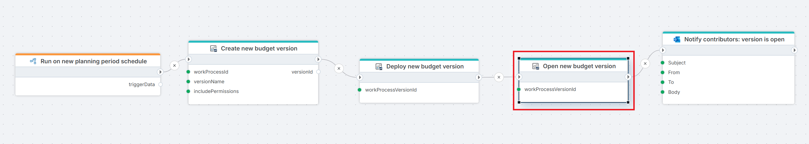

# Open Work Process Version

Opens a Work Process Version by changing its state to **Open**, thereby enabling it for contributor input. 

Use this action after [Deploy Work Process Version](./deploy-work-process-version.md) as part of an automated planning cycle setup, or as a standalone step to re-enable input on a previously closed version.

 

**Example**   
This Flow runs on a [Schedule trigger](../../../triggers/schedule-trigger.md) at the start of a new planning period to [create](./create-work-process-version.md) and [deploy a new budget version](./deploy-work-process-version.md), opens it for contributor input, and finally [notifies contributors by email](../../microsoft-365-outlook/send-email-from-shared-mailbox.md) that the version is ready for input.

## Properties

| Name | Required | Description |
|------|----------|-------------|
| Title | Optional | A descriptive title for the action, shown in the Flow designer canvas. |
| Connection | Required | The [InVision Connection](../invision-connection.md) to authenticate against. |
| Work Process Version | Required | The version to open. Select or enter the ID of the Work Process Version to open. |
| Include information messages in log | Optional | When enabled, informational messages from InVision are written to the Flow's execution log. Useful for debugging. |
| Changed by | Optional | The InVision user ID to record as the actor in the version's audit history. If omitted, the connection's service account is used. |
| Result variable name | Optional | Name of a Flow variable that will receive `true` if the version was opened successfully, or `false` if the operation failed. |
| Disabled | Optional | When set to `true`, this action is skipped during Flow execution. Useful for temporarily disabling the action during development and testing. |
| Description | Optional | Free-text notes about this action's purpose or configuration. Not used at runtime. |

## Result Variable

If you specify a **Result variable name**, the variable will be set to:

| Value | Meaning |
|-------|---------|
| `true` | The Work Process Version was successfully opened. |
| `false` | The operation failed — for example, the version was not found, was already open, or the connection lacked permission. |

Use a [Condition](../../built-in/if.md) action after this step to branch your flow based on the outcome.

## Notes

- **Prerequisites**: A version must be in a deployed state before it can be opened. Make sure [Deploy Work Process Version](./deploy-work-process-version.md) has run successfully beforehand.
- **Re-opening**: Opening an already-open version will typically return `false`. Use a [Condition](../../built-in/if.md) to check the current state before running this action if your flow may run more than once.
- **Permissions**: The InVision account used by the connection must have sufficient rights to open Work Process Versions.

## Related Actions

- [Create Work Process Version](./create-work-process-version.md) — creates a new version in draft state.
- [Deploy Work Process Version](./deploy-work-process-version.md) — deploys a version before it can be opened.
- [Close Work Process Version](./close-work-process-version.md) — closes a version at the end of an input period.
- [Delete Work Process Version](./delete-work-process-version.md) — deletes a version that is no longer needed.