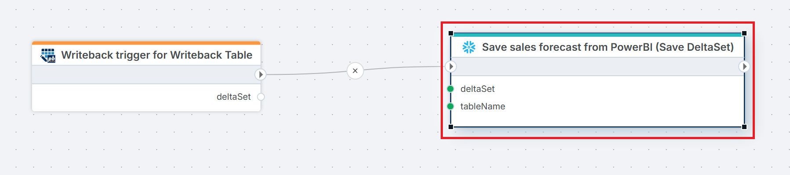

# Save DeltaSet

Saves all changes in a [DeltaSet](../../api-reference/built-in-types/deltaset.md#deltaset) to a [Snowflake](https://docs.snowflake.com/en/user-guide-getting-started) table by applying inserts, updates, and deletes.

A DeltaSet represents a set of row-level changes captured from a source such as the [Writeback Table](../../../PowerBI/writeback-table/overview.md) visual for Power BI. This action replays those changes against a Snowflake target table, making it the standard way to persist user edits from Power BI back to Snowflake.

**Example**   
This flow [receives](../../triggers/power-bi/writeback-table-trigger.md) a DeltaSet of changes from a Power BI writeback table and saves those changes to a Snowflake table by applying inserts, updates, and deletes.

## Properties

| Name           | Required | Description        |
|----------------|----------|--------------------|
| Title   | Optional | A display label for this action in the flow editor.  |
| Connection  | Required | The Snowflake [connection](./connecting-to-snowflake.md) to use.      |
| DeltaSet     | Required | The DeltaSet containing the changes to apply.  |
| Target table   | Required | The Snowflake table to save changes into. If this differs from the table the data is read from in the Power BI model, ensure the target table has columns with matching names and data types as defined in the Writeback Table visual's column definitions.      |
| [Save data options](#save-data-options)       | Optional | Overrides the default behaviour for applying DeltaSet changes. See [Save data options](#save-data-options) below. |
| Command timeout (sec)  | Optional | How long to wait before the command times out. Default is 120 seconds.    |

## Save data options

Use save data options to control how individual columns are handled when changes are applied. This is useful when the default key-matching or update behaviour needs to be overridden for specific columns.

| Property         | Description      |
|------------------|---------------|
| Column name      | The column to configure behaviour for.        |
| Use as update or delete key        | When enabled, this column is used to match rows when applying updates or deletes, instead of the keys defined in the [DeltaCells](../../api-reference/built-in-types/deltaset.md#deltacell).      |
| Allow updating data in this column | When set to `false`, this column will not be updated even if the DeltaSet contains changes for it.       |
| Enable identity insert             | Not applicable for Snowflake.         |