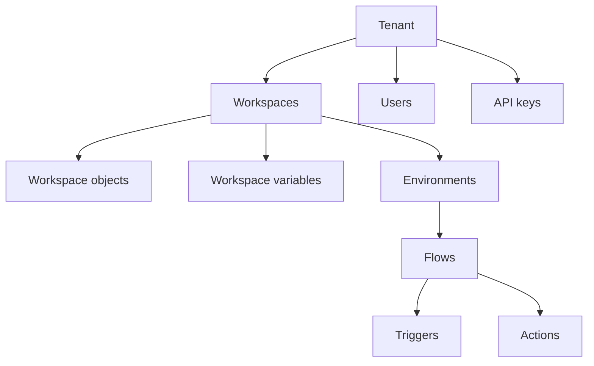

# Key concepts

Hypergene Flow is an automation platform that enables users to create sequences of operations by combining triggers and actions expressing various business processes, rules, and data integrations. Development takes place via a web-based drag-and-drop interface, with execution options available in both cloud and on-premises environments.

## Tenants

[Read more about Tenants](tenants.md)

A tenant is the foundation of a client account, encompassing subscription plans, user management, API keys, and billing information. Based on the subscription plan, a tenant has access to a defined set of resources like CPU, networking, and memory.

While typically a company corresponds to a single tenant, it is possible to create multiple tenants, each billed separately.

## Workspaces

[Read more about Workspaces](workspaces.md)

A Workspace is a logical container for Flows and shared artifacts. It also defines which users have access.

### Workspace objects

[Workspace Objects](workspaces/workspace-objects.md) are reusable objects that consist of multiple values — for example, a SQL Server connection with a server name, database name, username, and password. Instead of defining a separate connection for every SQL Server action, you can reuse an existing connection object and manage its settings in one place.

### Workspace variables

[Workspace Variables](workspaces/workspace-variables.md) are simple shared values such as connection strings, usernames, database names, or numeric values. Workspace Variables can also be used inside Workspace Objects.

Each Workspace Variable can hold a distinct value per environment. For example, a `ConnectionString` variable can point to different databases for Development and Production, allowing you to deploy Flows across environments without manual configuration changes.

### Environments

Hypergene Flow defines three environments:

- **Development** — where you build and iterate on Flows
- **Test** — for validation before production deployment
- **Production** — stable versions accessed by users and external APIs

While developing, you work in the Development environment. Once a Flow is ready, publish it to Test or Production so users can access a stable version while you continue development.

> [!NOTE]
> Access to the Test environment may not be available on free or lower-cost subscription plans.

[Read more about Environments](environments.md)

## Flows

[Read more about Flows](flows.md)

A Flow defines business logic by combining triggers and actions into a sequence of operations. Flows can be run manually from the Designer, triggered by a third-party app via an HTTP endpoint, started in response to an event in an external system, or scheduled to run on a regular basis.

### Triggers

Triggers run Flows in response to events from external systems — such as incoming mail, new files uploaded to Azure Storage, or a message added to an Azure Service Bus queue. A Flow can only contain a single trigger node, and it must be the first node in the Flow. Use the [Multi-Trigger](triggers/multi-trigger.md) if you need a Flow to react to events from multiple sources.

### Actions

Actions define the business logic of a Flow. Each action performs a single task. Most actions can take data as input and return data as output. Output from one action can be used as input to subsequent actions, provided the data formats are compatible.

## Architecture overview

